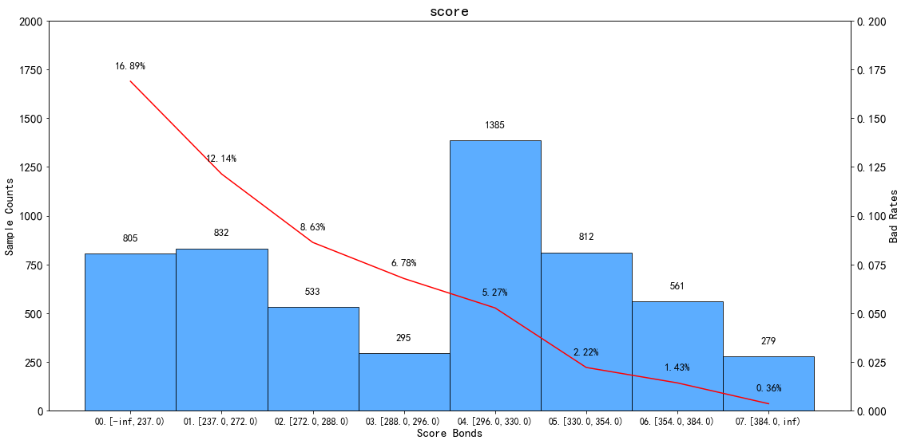
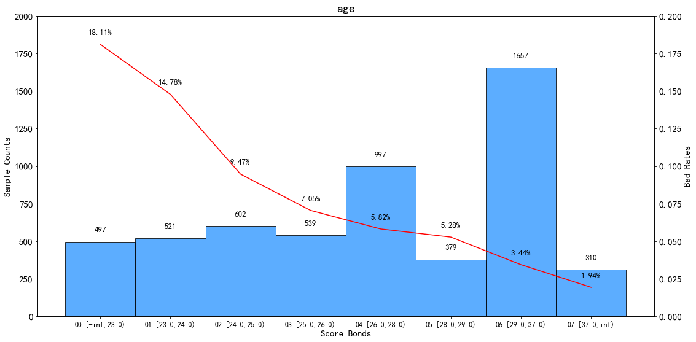
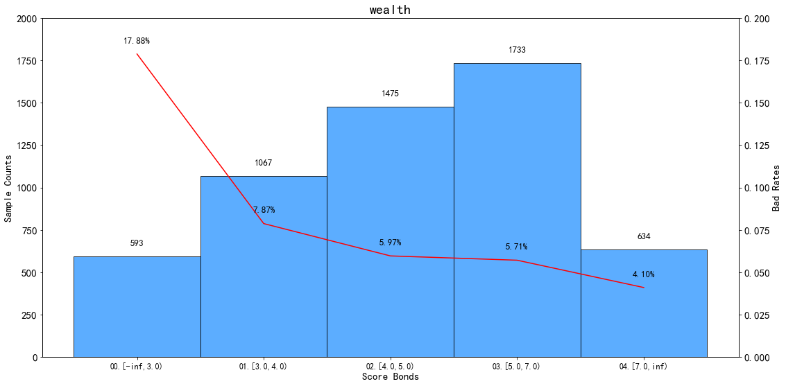
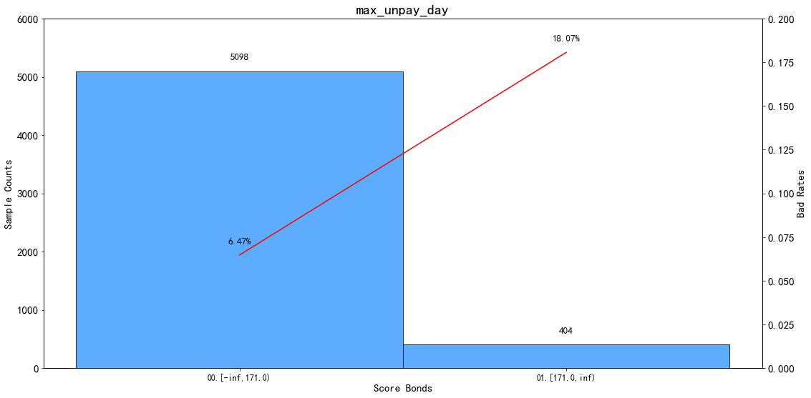
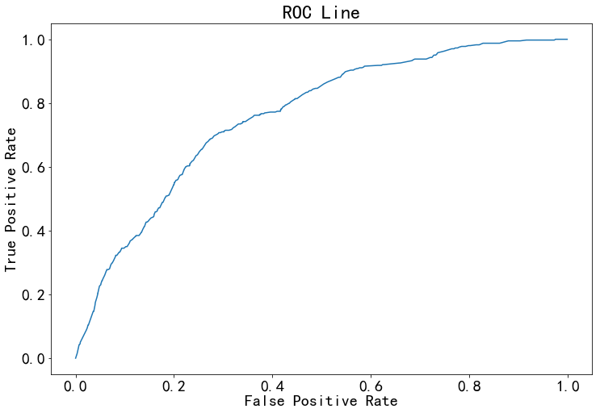
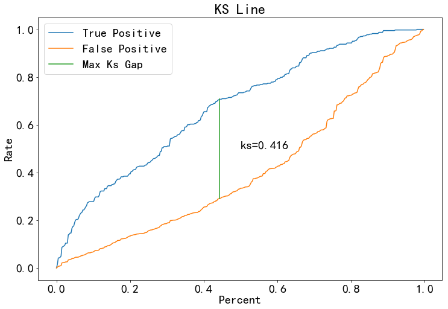
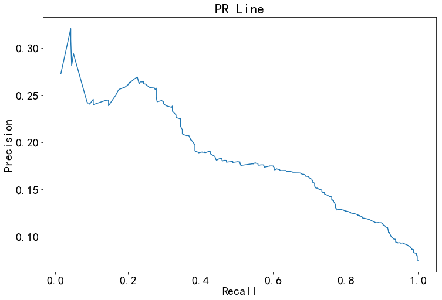

# LAPRAS

[PyPi version][pypi-url]
[Python version][docs-url]

Lapras is designed to make the model developing job easily and conveniently.
It contains these functions below in one key operation: data exploratory analysis, feature selection, feature binning,
data visualization, scorecard modeling(a logistic regression model with excellent interpretability), performance measure.

Let's get started.

## Usage

1.Exploratory Data Analysis
lapras.detect()
lapras.quality()
lapras.IV()
lapras.VIF()
lapras.PSI()

2.Feature Selection
lapras.select()
lapras.stepwise()

3.Binning
lapras.Combiner()
lapras.WOETransformer()
lapras.bin_stats()
lapras.bin_plot()

4.Modeling
lapras.ScoreCard()

5.Performance Measure
lapras.perform()
lapras.LIFT()
lapras.score_plot()
lapras.KS_bucket()
lapras.PPSI()
lapras.KS()
lapras.AUC()

6.One Key Auto Modeling
Lapras also provides a function which runs all the steps above automatically:
lapras.auto_model()

## Install

via pip

```bash
pip install lapras --upgrade -i https://pypi.org/simple
```

via source code

```bash
python setup.py install
```

install_requires = [
'numpy >= 1.18.4',
'pandas >= 0.25.1',
'scipy >= 1.3.2',
'scikit-learn =0.22.2',
'seaborn >= 0.10.1',
'statsmodels >= 0.13.1',
'tensorflow >= 2.2.0',
'hyperopt >= 0.2.7',
'pickle >= 4.0',
]

## Documents

```python
import lapras

import pandas as pd
import numpy as np
from sklearn.model_selection import train_test_split
import matplotlib as mpl
import matplotlib.pyplot as plt

pd.options.display.max_colwidth = 100
import math
%matplotlib inline
```

```python
# Read in data file
df = pd.read_csv('data/demo.csv',encoding="utf-8")
```

```python
to_drop = ['id'] # exclude the features which not being used， eg:id
target = 'bad' # Y label name
train_df, test_df, _, _ = train_test_split(df, df[[target]], test_size=0.3, random_state=42) # to divide the training set and testing set, strongly recommended
```

```python
# EDA(Exploratory Data Analysis)
# Parameter details：
# dataframe=None 
lapras.detect(train_df).sort_values("missing")
```

<div>

<table border="1" class="dataframe">
  <thead>
    <tr style="text-align: right;">
      <th></th>
      <th>type</th>
      <th>size</th>
      <th>missing</th>
      <th>unique</th>
      <th>mean_or_top1</th>
      <th>std_or_top2</th>
      <th>min_or_top3</th>
      <th>1%_or_top4</th>
      <th>10%_or_top5</th>
      <th>50%_or_bottom5</th>
      <th>75%_or_bottom4</th>
      <th>90%_or_bottom3</th>
      <th>99%_or_bottom2</th>
      <th>max_or_bottom1</th>
    </tr>
  </thead>
  <tbody>
    <tr>
      <td>id</td>
      <td>int64</td>
      <td>5502</td>
      <td>0.0000</td>
      <td>5502</td>
      <td>3947.266630</td>
      <td>2252.395671</td>
      <td>2.0</td>
      <td>87.03</td>
      <td>820.1</td>
      <td>3931.5</td>
      <td>5889.25</td>
      <td>7077.8</td>
      <td>7782.99</td>
      <td>7861.0</td>
    </tr>
    <tr>
      <td>bad</td>
      <td>int64</td>
      <td>5502</td>
      <td>0.0000</td>
      <td>2</td>
      <td>0.073246</td>
      <td>0.260564</td>
      <td>0.0</td>
      <td>0.00</td>
      <td>0.0</td>
      <td>0.0</td>
      <td>0.00</td>
      <td>0.0</td>
      <td>1.00</td>
      <td>1.0</td>
    </tr>
    <tr>
      <td>score</td>
      <td>int64</td>
      <td>5502</td>
      <td>0.0000</td>
      <td>265</td>
      <td>295.280625</td>
      <td>66.243181</td>
      <td>0.0</td>
      <td>0.00</td>
      <td>223.0</td>
      <td>303.0</td>
      <td>336.00</td>
      <td>366.0</td>
      <td>416.00</td>
      <td>461.0</td>
    </tr>
    <tr>
      <td>age</td>
      <td>float64</td>
      <td>5502</td>
      <td>0.0002</td>
      <td>34</td>
      <td>27.659880</td>
      <td>4.770299</td>
      <td>19.0</td>
      <td>21.00</td>
      <td>23.0</td>
      <td>27.0</td>
      <td>30.00</td>
      <td>34.0</td>
      <td>43.00</td>
      <td>53.0</td>
    </tr>
    <tr>
      <td>wealth</td>
      <td>float64</td>
      <td>5502</td>
      <td>0.0244</td>
      <td>18</td>
      <td>4.529806</td>
      <td>1.823149</td>
      <td>1.0</td>
      <td>1.00</td>
      <td>3.0</td>
      <td>4.0</td>
      <td>5.00</td>
      <td>7.0</td>
      <td>10.00</td>
      <td>22.0</td>
    </tr>
    <tr>
      <td>education</td>
      <td>float64</td>
      <td>5502</td>
      <td>0.1427</td>
      <td>5</td>
      <td>3.319483</td>
      <td>1.005660</td>
      <td>1.0</td>
      <td>1.00</td>
      <td>2.0</td>
      <td>4.0</td>
      <td>4.00</td>
      <td>4.0</td>
      <td>5.00</td>
      <td>5.0</td>
    </tr>
    <tr>
      <td>period</td>
      <td>float64</td>
      <td>5502</td>
      <td>0.1714</td>
      <td>5</td>
      <td>7.246326</td>
      <td>1.982060</td>
      <td>4.0</td>
      <td>4.00</td>
      <td>6.0</td>
      <td>6.0</td>
      <td>10.00</td>
      <td>10.0</td>
      <td>10.00</td>
      <td>14.0</td>
    </tr>
    <tr>
      <td>max_unpay_day</td>
      <td>float64</td>
      <td>5502</td>
      <td>0.9253</td>
      <td>11</td>
      <td>185.476886</td>
      <td>22.339647</td>
      <td>28.0</td>
      <td>86.00</td>
      <td>171.0</td>
      <td>188.0</td>
      <td>201.00</td>
      <td>208.0</td>
      <td>208.00</td>
      <td>208.0</td>
    </tr>
  </tbody>
</table>
</div>

```python
# Calculate IV value of features（Calculate by default decision tree binning）
# Parameter details：
# dataframe=None original data
# target = 'target' Y label name
lapras.quality(train_df.drop(to_drop,axis=1),target = target)
```

<div>

<table border="1" class="dataframe">
  <thead>
    <tr style="text-align: right;">
      <th></th>
      <th>iv</th>
      <th>unique</th>
    </tr>
  </thead>
  <tbody>
    <tr>
      <td>score</td>
      <td>0.758342</td>
      <td>265.0</td>
    </tr>
    <tr>
      <td>age</td>
      <td>0.504588</td>
      <td>35.0</td>
    </tr>
    <tr>
      <td>wealth</td>
      <td>0.275775</td>
      <td>19.0</td>
    </tr>
    <tr>
      <td>education</td>
      <td>0.230553</td>
      <td>6.0</td>
    </tr>
    <tr>
      <td>max_unpay_day</td>
      <td>0.170061</td>
      <td>12.0</td>
    </tr>
    <tr>
      <td>period</td>
      <td>0.073716</td>
      <td>6.0</td>
    </tr>
  </tbody>
</table>
</div>

```python
# Calculate PSI betweet features
# Parameter details：
# actual=None actual feature
# predict=None prediction feature
# bins=10 count of binning
# return_frame=False return the dataframe of binning if set to true
cols = list(lapras.quality(train_df,target = target).reset_index()['index'])
for col in cols:
    if col not in [target]:
        print("%s: %.4f" % (col,lapras.PSI(train_df[col], test_df[col])))
```

```python
score: 0.1500
age: 0.0147
wealth: 0.0070
education: 0.0010
max_unpay_day: 0.0042
id: 0.0000
period: 0.0030
```

```python
# Calculate VIF
# Parameter details：
# dataframe=None 
lapras.VIF(train_df.drop(['id','bad'],axis=1))
```

```python
wealth            1.124927
max_unpay_day     2.205619
score            18.266471
age              17.724547
period            1.193605
education         1.090158
dtype: float64
```

```python
# Calculate IV value
# Parameter details：
# feature=None feature data
# target=None Y label data
lapras.IV(train_df['age'],train_df[target])
```

```python
0.5045879202656338
```

```python
# Features filtering
# Parameter details：
# frame=None original data
# target=None Y label name
# empty=0.9 empty feature filtering， feature will be removed if data missing ratio greater than the threshold
# iv=0.02 IV value filtering， feature will be removed if IV value lesser than the threshold
# corr=0.7 correlation filtering， feature will be removed if correlation value greater than the threshold
# vif=False multicollinearity filtering， feature will be removed if multicollinearity value greater than the threshold, default False due to a large number of calculations 
# return_drop=False reture the removed features if set to true
# exclude=None features will be remained if set into this parameter
train_selected, dropped = lapras.select(train_df.drop(to_drop,axis=1),target = target, empty = 0.95, \
                                                iv = 0.05, corr = 0.9, vif = False, return_drop=True, exclude=[])
print(dropped)
print(train_selected.shape)
train_selected
```

```python
{'empty': array([], dtype=float64), 'iv': array([], dtype=object), 'corr': array([], dtype=object)}
(5502, 7)
```

<div>

<table border="1" class="dataframe">
  <thead>
    <tr style="text-align: right;">
      <th></th>
      <th>bad</th>
      <th>wealth</th>
      <th>max_unpay_day</th>
      <th>score</th>
      <th>age</th>
      <th>period</th>
      <th>education</th>
    </tr>
  </thead>
  <tbody>
    <tr>
      <td>4168</td>
      <td>0</td>
      <td>4.0</td>
      <td>NaN</td>
      <td>288</td>
      <td>23.0</td>
      <td>6.0</td>
      <td>4.0</td>
    </tr>
    <tr>
      <td>605</td>
      <td>0</td>
      <td>4.0</td>
      <td>NaN</td>
      <td>216</td>
      <td>32.0</td>
      <td>6.0</td>
      <td>4.0</td>
    </tr>
    <tr>
      <td>3018</td>
      <td>0</td>
      <td>5.0</td>
      <td>NaN</td>
      <td>250</td>
      <td>23.0</td>
      <td>6.0</td>
      <td>2.0</td>
    </tr>
    <tr>
      <td>4586</td>
      <td>0</td>
      <td>7.0</td>
      <td>171.0</td>
      <td>413</td>
      <td>31.0</td>
      <td>NaN</td>
      <td>2.0</td>
    </tr>
    <tr>
      <td>1468</td>
      <td>0</td>
      <td>5.0</td>
      <td>NaN</td>
      <td>204</td>
      <td>29.0</td>
      <td>6.0</td>
      <td>2.0</td>
    </tr>
    <tr>
      <td>...</td>
      <td>...</td>
      <td>...</td>
      <td>...</td>
      <td>...</td>
      <td>...</td>
      <td>...</td>
      <td>...</td>
    </tr>
    <tr>
      <td>5226</td>
      <td>0</td>
      <td>4.0</td>
      <td>171.0</td>
      <td>346</td>
      <td>23.0</td>
      <td>NaN</td>
      <td>3.0</td>
    </tr>
    <tr>
      <td>5390</td>
      <td>0</td>
      <td>5.0</td>
      <td>NaN</td>
      <td>207</td>
      <td>32.0</td>
      <td>NaN</td>
      <td>3.0</td>
    </tr>
    <tr>
      <td>860</td>
      <td>0</td>
      <td>6.0</td>
      <td>NaN</td>
      <td>356</td>
      <td>42.0</td>
      <td>4.0</td>
      <td>3.0</td>
    </tr>
    <tr>
      <td>7603</td>
      <td>0</td>
      <td>3.0</td>
      <td>NaN</td>
      <td>323</td>
      <td>34.0</td>
      <td>NaN</td>
      <td>3.0</td>
    </tr>
    <tr>
      <td>7270</td>
      <td>0</td>
      <td>4.0</td>
      <td>NaN</td>
      <td>378</td>
      <td>24.0</td>
      <td>10.0</td>
      <td>4.0</td>
    </tr>
  </tbody>
</table>
<p>5502 rows × 7 columns</p>
</div>

```python
# Feature Binning， following methods are supported: monotonous binning， decision tree binning， Kmeans binning， equal frequency binning， equal step size binning
# Parameter details：
# X=None original data
# y=None Y label name
# method='dt' Binning method：'dt':decision tree binning(default),'mono':monotonous binning,'kmeans':Kmeans binning,'quantile':equal frequency binning,'step':equal step size binning
# min_samples=1 the least sample numbers in each binning， represent the count of numbers when greater than 1， represent the ratio of total count when between 0 and 1
# n_bins=10 maximun binning count
# c.load(dict) adjust the binning by loading a customized dict
# c.export() export current binning information by dict format
c = lapras.Combiner()
c.fit(train_selected, y = target,method = 'mono', min_samples = 0.05,n_bins=8) #empty_separate = False
# # c.load({'age': [22.5, 23.5, 24.5, 25.5, 28.5,36.5],
# #  'education': [ 3.5],
# #  'max_unpay_day': [59.5],
# #  'period': [5.0, 9.0],
# #  'score': [205.5, 236.5, 265.5, 275.5, 294.5, 329.5, 381.5],
# #  'wealth': [2.5, 3.5, 6.5]})
c.export()
```

```python
{'age': [23.0, 24.0, 25.0, 26.0, 28.0, 29.0, 37.0],
'education': [3.0, 4.0],
'max_unpay_day': [171.0],
'period': [6.0, 10.0],
'score': [237.0, 272.0, 288.0, 296.0, 330.0, 354.0, 384.0],
'wealth': [3.0, 4.0, 5.0, 7.0]}
```

```python
# To transform the original data into binning data
# Parameter details：
# X=None original data
# labels=False binning label will be shown when set to true
c.transform(train_selected, labels=True).iloc[0:10,:]
```

<div>

<table border="1" class="dataframe">
  <thead>
    <tr style="text-align: right;">
      <th></th>
      <th>bad</th>
      <th>wealth</th>
      <th>max_unpay_day</th>
      <th>score</th>
      <th>age</th>
      <th>period</th>
      <th>education</th>
    </tr>
  </thead>
  <tbody>
    <tr>
      <td>4168</td>
      <td>0</td>
      <td>02.[4.0,5.0)</td>
      <td>00.[-inf,171.0)</td>
      <td>03.[288.0,296.0)</td>
      <td>01.[23.0,24.0)</td>
      <td>01.[6.0,10.0)</td>
      <td>02.[4.0,inf)</td>
    </tr>
    <tr>
      <td>605</td>
      <td>0</td>
      <td>02.[4.0,5.0)</td>
      <td>00.[-inf,171.0)</td>
      <td>00.[-inf,237.0)</td>
      <td>06.[29.0,37.0)</td>
      <td>01.[6.0,10.0)</td>
      <td>02.[4.0,inf)</td>
    </tr>
    <tr>
      <td>3018</td>
      <td>0</td>
      <td>03.[5.0,7.0)</td>
      <td>00.[-inf,171.0)</td>
      <td>01.[237.0,272.0)</td>
      <td>01.[23.0,24.0)</td>
      <td>01.[6.0,10.0)</td>
      <td>00.[-inf,3.0)</td>
    </tr>
    <tr>
      <td>4586</td>
      <td>0</td>
      <td>04.[7.0,inf)</td>
      <td>01.[171.0,inf)</td>
      <td>07.[384.0,inf)</td>
      <td>06.[29.0,37.0)</td>
      <td>00.[-inf,6.0)</td>
      <td>00.[-inf,3.0)</td>
    </tr>
    <tr>
      <td>1468</td>
      <td>0</td>
      <td>03.[5.0,7.0)</td>
      <td>00.[-inf,171.0)</td>
      <td>00.[-inf,237.0)</td>
      <td>06.[29.0,37.0)</td>
      <td>01.[6.0,10.0)</td>
      <td>00.[-inf,3.0)</td>
    </tr>
    <tr>
      <td>6251</td>
      <td>0</td>
      <td>03.[5.0,7.0)</td>
      <td>00.[-inf,171.0)</td>
      <td>01.[237.0,272.0)</td>
      <td>01.[23.0,24.0)</td>
      <td>02.[10.0,inf)</td>
      <td>00.[-inf,3.0)</td>
    </tr>
    <tr>
      <td>3686</td>
      <td>0</td>
      <td>00.[-inf,3.0)</td>
      <td>00.[-inf,171.0)</td>
      <td>00.[-inf,237.0)</td>
      <td>01.[23.0,24.0)</td>
      <td>01.[6.0,10.0)</td>
      <td>00.[-inf,3.0)</td>
    </tr>
    <tr>
      <td>3615</td>
      <td>0</td>
      <td>02.[4.0,5.0)</td>
      <td>00.[-inf,171.0)</td>
      <td>03.[288.0,296.0)</td>
      <td>06.[29.0,37.0)</td>
      <td>02.[10.0,inf)</td>
      <td>02.[4.0,inf)</td>
    </tr>
    <tr>
      <td>5338</td>
      <td>0</td>
      <td>00.[-inf,3.0)</td>
      <td>00.[-inf,171.0)</td>
      <td>04.[296.0,330.0)</td>
      <td>03.[25.0,26.0)</td>
      <td>02.[10.0,inf)</td>
      <td>00.[-inf,3.0)</td>
    </tr>
    <tr>
      <td>3985</td>
      <td>0</td>
      <td>03.[5.0,7.0)</td>
      <td>00.[-inf,171.0)</td>
      <td>01.[237.0,272.0)</td>
      <td>01.[23.0,24.0)</td>
      <td>01.[6.0,10.0)</td>
      <td>02.[4.0,inf)</td>
    </tr>
  </tbody>
</table>
</div>

```python
# To output bin_stats and bin_plot
# Parameter details：
# frame=None data transformed by Combiner, keeping binning labels
# col=None features to be outputed
# target='target' Y label name

# Note：The binning details may be different between traning set and testing set due to Population Stability. 
cols = list(lapras.quality(train_selected,target = target).reset_index()['index'])
for col in cols:
    if col != target:
        print(lapras.bin_stats(c.transform(train_selected[[col, target]], labels=True), col=col, target=target))
        lapras.bin_plot(c.transform(train_selected[[col,target]], labels=True), col=col, target=target)
```

```python
          score  bad_count  total_count  bad_rate     ratio       woe  \
0   00.[-inf,237.0)        136          805  0.168944  0.146310  0.944734
1  01.[237.0,272.0)        101          832  0.121394  0.151218  0.558570
2  02.[272.0,288.0)         46          533  0.086304  0.096874  0.178240
3  03.[288.0,296.0)         20          295  0.067797  0.053617 -0.083176
4  04.[296.0,330.0)         73         1385  0.052708  0.251727 -0.350985
5  05.[330.0,354.0)         18          812  0.022167  0.147583 -1.248849
6  06.[354.0,384.0)          8          561  0.014260  0.101963 -1.698053
7    07.[384.0,inf)          1          279  0.003584  0.050709 -3.089758

     iv  total_iv  
0  0.194867  0.735116
1  0.059912  0.735116
2  0.003322  0.735116
3  0.000358  0.735116
4  0.026732  0.735116
5  0.138687  0.735116
6  0.150450  0.735116
7  0.160788  0.735116
```



```python
          age  bad_count  total_count  bad_rate     ratio       woe  \
0  00.[-inf,23.0)         90          497  0.181087  0.090331  1.028860
1  01.[23.0,24.0)         77          521  0.147793  0.094693  0.785844
2  02.[24.0,25.0)         57          602  0.094684  0.109415  0.280129
3  03.[25.0,26.0)         38          539  0.070501  0.097964 -0.041157
4  04.[26.0,28.0)         58          997  0.058175  0.181207 -0.246509
5  05.[28.0,29.0)         20          379  0.052770  0.068884 -0.349727
6  06.[29.0,37.0)         57         1657  0.034400  0.301163 -0.796844
7   07.[37.0,inf)          6          310  0.019355  0.056343 -1.387405

     iv  total_iv  
0  0.147647   0.45579
1  0.081721   0.45579
2  0.009680   0.45579
3  0.000163   0.45579
4  0.009918   0.45579
5  0.007267   0.45579
6  0.137334   0.45579
7  0.062060   0.45579
```



```python
      wealth  bad_count  total_count  bad_rate     ratio       woe  \
0  00.[-inf,3.0)        106          593  0.178752  0.107779  1.013038
1   01.[3.0,4.0)         84         1067  0.078725  0.193929  0.078071
2   02.[4.0,5.0)         88         1475  0.059661  0.268084 -0.219698
3   03.[5.0,7.0)         99         1733  0.057126  0.314976 -0.265803
4   04.[7.0,inf)         26          634  0.041009  0.115231 -0.614215

     iv  total_iv  
0  0.169702  0.236205
1  0.001222  0.236205
2  0.011787  0.236205
3  0.019881  0.236205
4  0.033612  0.236205
```



```python
   education  bad_count  total_count  bad_rate     ratio       woe  \
0  00.[-inf,3.0)        225         2123  0.105982  0.385860  0.405408
1   01.[3.0,4.0)         61          648  0.094136  0.117775  0.273712
2   02.[4.0,inf)        117         2731  0.042841  0.496365 -0.568600

     iv  total_iv  
0  0.075439  0.211775
1  0.009920  0.211775
2  0.126415  0.211775
```


```python
 max_unpay_day  bad_count  total_count  bad_rate     ratio       woe  \
0  00.[-inf,171.0)        330         5098  0.064731  0.926572 -0.132726
1   01.[171.0,inf)         73          404  0.180693  0.073428  1.026204

     iv  total_iv  
0  0.015426  0.134699
1  0.119272  0.134699
```



```python
      period  bad_count  total_count  bad_rate     ratio       woe  \
0  00.[-inf,6.0)         52         1158  0.044905  0.210469 -0.519398
1  01.[6.0,10.0)        218         2871  0.075932  0.521810  0.038912
2  02.[10.0,inf)        133         1473  0.090292  0.267721  0.227787

     iv  total_iv  
0  0.045641  0.061758
1  0.000803  0.061758
2  0.015314  0.061758
```


```python
# WOE value transformation
# transer.fit()：
# X=None data transformed by Combiner
# y=None Y label
# exclude=None features exclude from transformation

# transer.transform()：
# X=None 

# transer.export()：

# Note： Only training set need to be fit
transfer = lapras.WOETransformer()
transfer.fit(c.transform(train_selected), train_selected[target], exclude=[target])

train_woe = transfer.transform(c.transform(train_selected))
transfer.export()
```

```python
{'age': {0: 1.0288596439961428,
1: 0.7858440185299318,
2: 0.2801286322797789,
3: -0.041156782250006324,
4: -0.24650930955337075,
5: -0.34972695582581514,
6: -0.7968444812848496,
7: -1.387405073069694},
'education': {0: 0.4054075821430197,
1: 0.27371220345368763,
2: -0.5685998002779383},
'max_unpay_day': {0: -0.13272639517618706, 1: 1.026204224879801},
'period': {0: -0.51939830439238,
1: 0.0389118677598222,
2: 0.22778739438526965},
'score': {0: 0.9447339847162963,
1: 0.5585702161999536,
2: 0.17824043251497793,
3: -0.08317566500410743,
4: -0.3509853692471706,
5: -1.2488485442424984,
6: -1.6980533007340262,
7: -3.089757954582164},
'wealth': {0: 1.01303813013795,
1: 0.0780708378046198,
2: -0.21969844672815222,
3: -0.2658032661768855,
4: -0.6142151848362123}}
```

```python
# Features filtering could be done once more after transformed into WOE value. This is optional.
train_woe, dropped = lapras.select(train_woe,target = target, empty = 0.9, \
                                                iv = 0.02, corr = 0.9, vif = False, return_drop=True, exclude=[])
print(dropped)
print(train_woe.shape)
train_woe.head(10)
```

```python
{'empty': array([], dtype=float64), 'iv': array([], dtype=object), 'corr': array([], dtype=object)}
(5502, 7)
```

<div>

<table border="1" class="dataframe">
  <thead>
    <tr style="text-align: right;">
      <th></th>
      <th>bad</th>
      <th>wealth</th>
      <th>max_unpay_day</th>
      <th>score</th>
      <th>age</th>
      <th>period</th>
      <th>education</th>
    </tr>
  </thead>
  <tbody>
    <tr>
      <td>4168</td>
      <td>0</td>
      <td>-0.219698</td>
      <td>-0.132726</td>
      <td>-0.083176</td>
      <td>0.785844</td>
      <td>0.038912</td>
      <td>-0.568600</td>
    </tr>
    <tr>
      <td>605</td>
      <td>0</td>
      <td>-0.219698</td>
      <td>-0.132726</td>
      <td>0.944734</td>
      <td>-0.796844</td>
      <td>0.038912</td>
      <td>-0.568600</td>
    </tr>
    <tr>
      <td>3018</td>
      <td>0</td>
      <td>-0.265803</td>
      <td>-0.132726</td>
      <td>0.558570</td>
      <td>0.785844</td>
      <td>0.038912</td>
      <td>0.405408</td>
    </tr>
    <tr>
      <td>4586</td>
      <td>0</td>
      <td>-0.614215</td>
      <td>1.026204</td>
      <td>-3.089758</td>
      <td>-0.796844</td>
      <td>-0.519398</td>
      <td>0.405408</td>
    </tr>
    <tr>
      <td>1468</td>
      <td>0</td>
      <td>-0.265803</td>
      <td>-0.132726</td>
      <td>0.944734</td>
      <td>-0.796844</td>
      <td>0.038912</td>
      <td>0.405408</td>
    </tr>
    <tr>
      <td>6251</td>
      <td>0</td>
      <td>-0.265803</td>
      <td>-0.132726</td>
      <td>0.558570</td>
      <td>0.785844</td>
      <td>0.227787</td>
      <td>0.405408</td>
    </tr>
    <tr>
      <td>3686</td>
      <td>0</td>
      <td>1.013038</td>
      <td>-0.132726</td>
      <td>0.944734</td>
      <td>0.785844</td>
      <td>0.038912</td>
      <td>0.405408</td>
    </tr>
    <tr>
      <td>3615</td>
      <td>0</td>
      <td>-0.219698</td>
      <td>-0.132726</td>
      <td>-0.083176</td>
      <td>-0.796844</td>
      <td>0.227787</td>
      <td>-0.568600</td>
    </tr>
    <tr>
      <td>5338</td>
      <td>0</td>
      <td>1.013038</td>
      <td>-0.132726</td>
      <td>-0.350985</td>
      <td>-0.041157</td>
      <td>0.227787</td>
      <td>0.405408</td>
    </tr>
    <tr>
      <td>3985</td>
      <td>0</td>
      <td>-0.265803</td>
      <td>-0.132726</td>
      <td>0.558570</td>
      <td>0.785844</td>
      <td>0.038912</td>
      <td>-0.568600</td>
    </tr>
  </tbody>
</table>
</div>

```python
# stepwise regression, to select best features, this is optional
# Parameter details：
# frame=None original data
# target='target' Y label name
# estimator='ols' model for regression, supporting 'ols', 'lr', 'lasso', 'ridge'
# direction='both' direction for stepwise, supporting 'forward', 'backward', 'both' 
# criterion='aic' metric, supporting 'aic', 'bic', 'ks', 'auc'
# max_iter=None max iteration times
# return_drop=False return cols being removed if set to true
# exclude=None exclude features
final_data = lapras.stepwise(train_woe,target = target, estimator='ols', direction = 'both', criterion = 'aic', exclude = [])
final_data
```

<div>

<table border="1" class="dataframe">
  <thead>
    <tr style="text-align: right;">
      <th></th>
      <th>bad</th>
      <th>wealth</th>
      <th>max_unpay_day</th>
      <th>score</th>
      <th>age</th>
    </tr>
  </thead>
  <tbody>
    <tr>
      <td>4168</td>
      <td>0</td>
      <td>-0.219698</td>
      <td>-0.132726</td>
      <td>-0.083176</td>
      <td>0.785844</td>
    </tr>
    <tr>
      <td>605</td>
      <td>0</td>
      <td>-0.219698</td>
      <td>-0.132726</td>
      <td>0.944734</td>
      <td>-0.796844</td>
    </tr>
    <tr>
      <td>3018</td>
      <td>0</td>
      <td>-0.265803</td>
      <td>-0.132726</td>
      <td>0.558570</td>
      <td>0.785844</td>
    </tr>
    <tr>
      <td>4586</td>
      <td>0</td>
      <td>-0.614215</td>
      <td>1.026204</td>
      <td>-3.089758</td>
      <td>-0.796844</td>
    </tr>
    <tr>
      <td>1468</td>
      <td>0</td>
      <td>-0.265803</td>
      <td>-0.132726</td>
      <td>0.944734</td>
      <td>-0.796844</td>
    </tr>
    <tr>
      <td>...</td>
      <td>...</td>
      <td>...</td>
      <td>...</td>
      <td>...</td>
      <td>...</td>
    </tr>
    <tr>
      <td>5226</td>
      <td>0</td>
      <td>-0.219698</td>
      <td>1.026204</td>
      <td>-1.248849</td>
      <td>0.785844</td>
    </tr>
    <tr>
      <td>5390</td>
      <td>0</td>
      <td>-0.265803</td>
      <td>-0.132726</td>
      <td>0.944734</td>
      <td>-0.796844</td>
    </tr>
    <tr>
      <td>860</td>
      <td>0</td>
      <td>-0.265803</td>
      <td>-0.132726</td>
      <td>-1.698053</td>
      <td>-1.387405</td>
    </tr>
    <tr>
      <td>7603</td>
      <td>0</td>
      <td>0.078071</td>
      <td>-0.132726</td>
      <td>-0.350985</td>
      <td>-0.796844</td>
    </tr>
    <tr>
      <td>7270</td>
      <td>0</td>
      <td>-0.219698</td>
      <td>-0.132726</td>
      <td>-1.698053</td>
      <td>0.280129</td>
    </tr>
  </tbody>
</table>
<p>5502 rows × 5 columns</p>
</div>

```python
# Scorecard modeling
# Parameter details：
# base_odds=1/60,base_score=600 When base_odds is 1/60, the corresponding base_score will be 600
# pdo=40,rate=2 If the base_odds decrease by half, the corresponding pdo will increase by 40, these are the default parameters
# combiner=None Combiner, input the fitted object
# transfer=None WOETransformer, input the fitted object

# ScoreCard.fit()：
# X=None WOE value
# y=None Y label
card = lapras.ScoreCard(
    combiner = c,
    transfer = transfer
)
col = list(final_data.drop([target],axis=1).columns)
card.fit(final_data[col], final_data[target])

```

```python
ScoreCard(base_odds=0.016666666666666666, base_score=600, card=None,
combiner=<lapras.transform.Combiner object at 0x000001EC0FB72438>,
pdo=40, rate=2,
transfer=<lapras.transform.WOETransformer object at 0x000001EC0FDAEF98>)
```

```python
# ScoreCard class method expaination
# ScoreCard.predict() predict score for each sample：
# X=None 

# ScoreCard.predict_prob() predict prob for each sample：
# X=None 

# ScoreCard.export() output the details of scorecard by dict format

# ScoreCard.get_params() to get the parameters of scorecard by dict format, usually used in deployment

# card.intercept_  intercept of logical regression
# card.coef_  coefficient of logical regression

final_result = final_data[[target]].copy()
score = card.predict(final_data[col])
prob = card.predict_prob(final_data[col])

final_result['score'] = score
final_result['prob'] = prob
print("card.intercept_:%s" % (card.intercept_))
print("card.coef_:%s" % (card.coef_))
card.get_params()['combiner']
card.get_params()['transfer']
card.export()
```

```python
card.intercept_:-2.5207582925622476
card.coef_:[0.32080944 0.3452988  0.68294643 0.66842902]

{'age': {'[-inf,23.0)': -39.69,
'[23.0,24.0)': -30.31,
'[24.0,25.0)': -10.81,
'[25.0,26.0)': 1.59,
'[26.0,28.0)': 9.51,
'[28.0,29.0)': 13.49,
'[29.0,37.0)': 30.74,
'[37.0,inf)': 53.52},
'intercept': {'[-inf,inf)': 509.19},
'max_unpay_day': {'[-inf,171.0)': 2.64, '[171.0,inf)': -20.45},
'score': {'[-inf,237.0)': -37.23,
'[237.0,272.0)': -22.01,
'[272.0,288.0)': -7.02,
'[288.0,296.0)': 3.28,
'[296.0,330.0)': 13.83,
'[330.0,354.0)': 49.22,
'[354.0,384.0)': 66.92,
'[384.0,inf)': 121.77},
'wealth': {'[-inf,3.0)': -18.75,
'[3.0,4.0)': -1.45,
'[4.0,5.0)': 4.07,
'[5.0,7.0)': 4.92,
'[7.0,inf)': 11.37}}
```

```python
# model performance metrics, including KS, AUC, ROC curve, KS curve, PR curve
# Parameter details
# feature=None predicted value
# target=None actual label
lapras.perform(prob,final_result[target])
```

```python
KS: 0.4160
AUC: 0.7602
```







```python
# Parameter details
# frame=None original dataframe
# score='score' score label name
# target='target' Y label name
# score_bond=None score boundary, default by 30, customized by list, e.g. [100,200,300]
lapras.score_plot(final_result,score='score', target=target)
```

```python
bad: [42, 78, 70, 104, 61, 28, 18, 1, 1, 0]
good: [129, 249, 494, 795, 1075, 972, 825, 282, 164, 114]
all: [171, 327, 564, 899, 1136, 1000, 843, 283, 165, 114]
all_rate: ['3.11%', '5.94%', '10.25%', '16.34%', '20.65%', '18.18%', '15.32%', '5.14%', '3.00%', '2.07%']
bad_rate: ['24.56%', '23.85%', '12.41%', '11.57%', '5.37%', '2.80%', '2.14%', '0.35%', '0.61%', '0.00%']
```


```python
# LIFT show
# feature=None predicted value
# target=None actual label
# recall_list=[0.1, 0.2, 0.3, 0.4, 0.5, 0.6, 0.7, 0.8, 0.9, 1] default
lapras.LIFT(prob,final_data[target])
```

<div>

<table border="1" class="dataframe">
  <thead>
    <tr style="text-align: right;">
      <th></th>
      <th>recall</th>
      <th>precision</th>
      <th>improve</th>
    </tr>
  </thead>
  <tbody>
    <tr>
      <td>0</td>
      <td>0.1</td>
      <td>0.240000</td>
      <td>3.202779</td>
    </tr>
    <tr>
      <td>1</td>
      <td>0.2</td>
      <td>0.261290</td>
      <td>3.486897</td>
    </tr>
    <tr>
      <td>2</td>
      <td>0.3</td>
      <td>0.240964</td>
      <td>3.215642</td>
    </tr>
    <tr>
      <td>3</td>
      <td>0.4</td>
      <td>0.189535</td>
      <td>2.529327</td>
    </tr>
    <tr>
      <td>4</td>
      <td>0.5</td>
      <td>0.179170</td>
      <td>2.391013</td>
    </tr>
    <tr>
      <td>5</td>
      <td>0.6</td>
      <td>0.174352</td>
      <td>2.326707</td>
    </tr>
    <tr>
      <td>6</td>
      <td>0.7</td>
      <td>0.161622</td>
      <td>2.156831</td>
    </tr>
    <tr>
      <td>7</td>
      <td>0.8</td>
      <td>0.126972</td>
      <td>1.694425</td>
    </tr>
    <tr>
      <td>8</td>
      <td>0.9</td>
      <td>0.113936</td>
      <td>1.520466</td>
    </tr>
    <tr>
      <td>9</td>
      <td>1.0</td>
      <td>0.074935</td>
      <td>1.000000</td>
    </tr>
  </tbody>
</table>
</div>

# Automatical modeling

```python
# auto_model parameters  df,target,to_drop are necessary, others are optional
# bins_show=False showing the binning graphs when set to true
# iv_rank=False feature IV values will be ranked when set to true
# perform_show=False showing performance(training set)
# coef_negative=True coefficient can be negative if set to true
# return: ScoreCard object
auto_card = lapras.auto_model(df=train_df,target=target,to_drop=to_drop,bins_show=False,iv_rank=False,perform_show=False,
                              coef_negative = False, empty = 0.95, iv = 0.02, corr = 0.9, vif = False, method = 'mono',
                              n_bins=8, min_samples=0.05, pdo=40, rate=2, base_odds=1 / 60, base_score=600)
```

```python
——data filtering——
original feature：6  filtered features：6

——feature binning——

——WOE value transformation——

——feature filtering once more——
original feature：6  filtered features：6

——scorecard modeling——
intercept: -2.520670026708529
coef: [0.66928671 0.59743968 0.31723278 0.22972838 0.28750881 0.26435224]

——model performance metrics——
KS: 0.4208
AUC: 0.7626
   recall  precision   improve
0     0.1   0.238095  3.188586
1     0.2   0.254777  3.411990
2     0.3   0.239521  3.207679
3     0.4   0.193742  2.594611
4     0.5   0.182805  2.448141
5     0.6   0.171510  2.296866
6     0.7   0.160501  2.149437
7     0.8   0.130259  1.744435
8     0.9   0.110603  1.481206
9     1.0   0.074671  1.000000

Automatic modeling finished, time costing： 0 second
```

[pypi-image]: https://img.shields.io/badge/pypi-V0.0.22-%3Cgreen%3E
[pypi-url]: https://github.com/yhangang/lapras
[python-image]: https://img.shields.io/pypi/pyversions/toad.svg?style=flat-square
[docs-url]: https://github.com/yhangang/lapras
